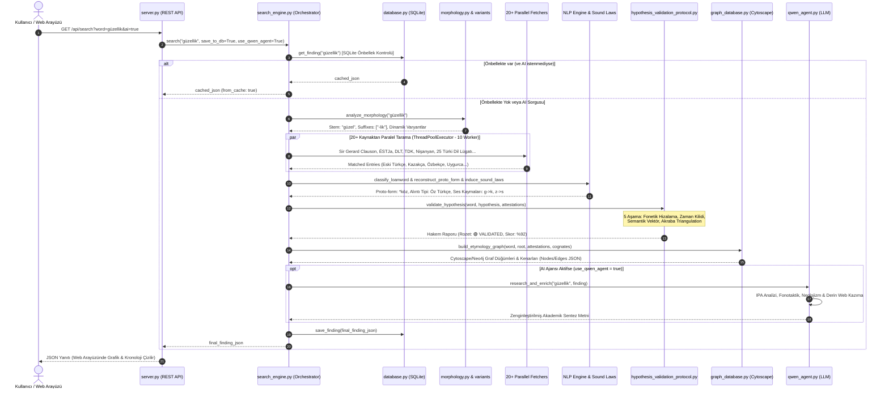
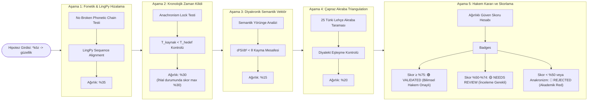

# 🌍 Türki Diller Etimoloji Araştırma Motoru (System Architecture & Pipeline Technical Document)

Bu doküman, **Türki Diller Etimoloji Araştırma Motoru** projesinin arka planındaki yazılım mimarisini, veri alma hatlarını, hesaplamalı dilbilim/NLP motorlarını, Neo4j uyumlu graf veritabanı yapısını ve 5 aşamalı **Yapay Zeka Hakem Protokolü'nü (A-HVP)** kapsayıcı diyagramlar ve teknik ayrıntılarla açıklamaktadır.

---

## 1. Yüksek Seviye Sistem Mimarisi (High-Level System Architecture)

Sistem; istemci katmanı, REST API/CLI arayüzleri, ana orkestrasyon motoru, 20+ paralel veri toplayıcı, NLP hesaplama modülleri, A-HVP hakem mekanizması, LLM zenginleştirme ajanı ve veri kalıcılık katmanlarından oluşan modüler bir mimariye sahiptir.

```mermaid
graph TD
    %% İstemci ve Giriş Katmanı
    subgraph ClientLayer ["1. İstemci & Arayüz Katmanı"]
        WebUI["Web UI (Next.js / Cytoscape.js)<br/>[index.html](file:///Users/mshn/Documents/etimoloji/web/index.html)"]
        CLI["CLI Komut Satırı Arayüzü<br/>[cli.py](file:///Users/mshn/Documents/etimoloji/engine/cli.py)"]
    end

    %% REST API Sunucusu
    subgraph ServerLayer ["2. REST API & Sunucu Katmanı"]
        API["Python HTTP Server REST API<br/>[server.py](file:///Users/mshn/Documents/etimoloji/engine/server.py)<br/>GET /api/search | GET /api/list"]
    end

    %% Ana Araştırma & Orkestrasyon Motoru
    subgraph CoreEngine ["3. Ana Orkestrasyon Motoru"]
        SearchEngine["SearchEngine Motoru<br/>[search_engine.py](file:///Users/mshn/Documents/etimoloji/engine/search_engine.py)"]
        MorphEngine["Morfoloji & Fonetik Varyasyon<br/>[morphology.py](file:///Users/mshn/Documents/etimoloji/engine/utils/morphology.py)"]
    end

    %% Paralel Veri Toplama Katmanı (20+ Fetcher)
    subgraph FetcherLayer ["4. 20+ Paralel Veri Katmanı (ThreadPoolExecutor)"]
        Fetchers["Parallel Fetchers Portföyü<br/>[engine/fetchers](file:///Users/mshn/Documents/etimoloji/engine/fetchers)<br/>• Sir Gerard Clauson (EDPT) & Sevortjan ÉSTJa<br/>• Divanü Lugati't-Türk & Kamus-ı Türkî<br/>• TDV İSAM & Codex Cumanicus<br/>• TDK (GTS, Tarama, Derleme, TTAS)<br/>• Nişanyan & Starling Altaic DB<br/>• 25 Türki Ülke İzahlı Lügatı (Azleks, Savodxon vb.)<br/>• Alıntı Dil Kökleri (Arapça, Farsça, Grekçe vb.)"]
    end

    %% Hesaplamalı Dilbilim ve NLP Katmanı
    subgraph NLPLayer ["5. Dilbilimsel & NLP Zeka Katmanı"]
        LoanClass["Alıntı Kelime Sınıflandırıcı<br/>[loanword_classifier.py](file:///Users/mshn/Documents/etimoloji/engine/nlp/loanword_classifier.py)"]
        Reconstruct["Proto-Türkçe Rekonstrüktör<br/>[reconstruction.py](file:///Users/mshn/Documents/etimoloji/engine/nlp/reconstruction.py)"]
        SoundLaw["Ses Yasası İndüksiyonu<br/>[sound_law_induction.py](file:///Users/mshn/Documents/etimoloji/engine/nlp/sound_law_induction.py)"]
        LingPy["CLDF LingPy Hizalayıcı<br/>[cldf_lingpy_aligner.py](file:///Users/mshn/Documents/etimoloji/engine/nlp/cldf_lingpy_aligner.py)"]
        SemanticEngine["Diyakronik Semantik Vektör Motoru<br/>[diachronic_semantic_engine.py](file:///Users/mshn/Documents/etimoloji/engine/nlp/diachronic_semantic_engine.py)"]
        HypoEngine["Otonom İnatçı Prover<br/>[iterative_hypothesis_prover.py](file:///Users/mshn/Documents/etimoloji/engine/nlp/iterative_hypothesis_prover.py)"]
    end

    %% A-HVP Akademik Hakem Protokolü
    subgraph AHVP ["6. A-HVP Yapay Zeka Hakem Protokolü (5 Aşama)"]
        ValidationProtocol["HypothesisValidationProtocol<br/>[hypothesis_validation_protocol.py](file:///Users/mshn/Documents/etimoloji/engine/nlp/hypothesis_validation_protocol.py)<br/>🟢 VALIDATED (%75+) | 🟡 NEEDS REVIEW | 🔴 REJECTED"]
    end

    %% LLM & Sentez Katmanı
    subgraph LLMLayer ["7. LLM Yapay Zeka Katmanı"]
        QwenAgent["Qwen2.5:14b Ollama Ajansı<br/>[qwen_agent.py](file:///Users/mshn/Documents/etimoloji/engine/llm/qwen_agent.py)"]
        WebScraper["Canlı Akademik Web Kazıyıcı<br/>[full_web_scraper.py](file:///Users/mshn/Documents/etimoloji/engine/nlp/full_web_scraper.py)"]
    end

    %% Veritabanı ve Çizge Katmanı
    subgraph DBLayer ["8. Kalıcılık & Çizge Graf Katmanı"]
        SQLiteDB["SQLite Veritabanı (etymology.db)<br/>[database.py](file:///Users/mshn/Documents/etimoloji/engine/db/database.py)"]
        GraphDB["Neo4j / Cytoscape Graf Üretici<br/>[graph_database.py](file:///Users/mshn/Documents/etimoloji/engine/db/graph_database.py)"]
    end

    %% Bağlantılar
    WebUI -->|HTTP GET /api/search| API
    CLI -->|Doğrudan Çağrı| SearchEngine
    API --> SearchEngine
    SearchEngine --> MorphEngine
    SearchEngine -->|10 Worker Thread| Fetchers
    Fetchers -->|Ham Sözlük & Metin Verisi| SearchEngine
    SearchEngine --> NLPLayer
    NLPLayer --> AHVP
    AHVP -->|Skor & Rozet| SearchEngine
    SearchEngine --> GraphDB
    SearchEngine -->|Yapay Zeka Modu Aktifse| QwenAgent
    QwenAgent --> WebScraper
    SearchEngine --> SQLiteDB
    SearchEngine -->|JSON Yanıtı| API
    API -->|Graf & Etimoloji JSON| WebUI
```

---

## 2. Temel Modül Haritası

| Katman | Modül Dosyası | Açıklama & Sorumluluk |
| :--- | :--- | :--- |
| **Giriş / REST API** | [server.py](file:///Users/mshn/Documents/etimoloji/engine/server.py) | Python `HTTPServer` tabanlı REST API. `/api/search` ve `/api/list` uç noktalarını sunar. |
| **Giriş / CLI** | [cli.py](file:///Users/mshn/Documents/etimoloji/engine/cli.py) | Tekil arama (`search`), toplu arama (`bulk`), kayıt listeleme (`list`) komut satırı arayüzü. |
| **Orkestrasyon** | [search_engine.py](file:///Users/mshn/Documents/etimoloji/engine/search_engine.py) | Arama akışını yöneten, veri fetcher'larını paralelleştiren ve NLP/A-HVP katmanlarını tetikleyen ana motor. |
| **Veri Toplama** | [engine/fetchers](file:///Users/mshn/Documents/etimoloji/engine/fetchers) | Clauson, Sevortjan, DLT, TDK, Nişanyan, Starling, Tietze, 25 Türki dil lügatı dahil 20+ veri kaynağı toplayıcısı. |
| **Morfoloji** | [morphology.py](file:///Users/mshn/Documents/etimoloji/engine/utils/morphology.py) | Kelimeleri eklerinden temizleyerek kök biçimlerini tespit eder (`güzellik` $\rightarrow$ `güzel`). |
| **Alıntı Analizi** | [loanword_classifier.py](file:///Users/mshn/Documents/etimoloji/engine/nlp/loanword_classifier.py) | Arapça (üçlü ünsüz vezinleri), Farsça ve Batı dilleri alıntı örüntülerini tespit eder. |
| **Rekonstrüksiyon** | [reconstruction.py](file:///Users/mshn/Documents/etimoloji/engine/nlp/reconstruction.py) | Diyalektik ses değişim kurallarını uygulayarak Proto-Türkçe kök rekonstrüksiyonu yapar (`*kōz`). |
| **Hakem Protokolü** | [hypothesis_validation_protocol.py](file:///Users/mshn/Documents/etimoloji/engine/nlp/hypothesis_validation_protocol.py) | Hipotezleri 5 akademik testten geçirir ve bilimsel rozet (🟢 / 🟡 / 🔴) ile skor üretir. |
| **Çizge Veritabanı** | [graph_database.py](file:///Users/mshn/Documents/etimoloji/engine/db/graph_database.py) | Neo4j ve Cytoscape.js ile uyumlu düğüm (`WordForm`, `ProtoRoot`, `Attestation`) ve kenar haritası üretir. |
| **LLM Ajansı** | [qwen_agent.py](file:///Users/mshn/Documents/etimoloji/engine/llm/qwen_agent.py) | Ollama üzerindeki `qwen2.5:14b` modelini kullanarak derinlikli etimoloji raporu oluşturur. |
| **Veri Kalıcılığı** | [database.py](file:///Users/mshn/Documents/etimoloji/engine/db/database.py) | Aramaları SQLite (`etymology.db`) üzerinde önbellekler. |

---

## 3. Uçtan Uca Arama & İcra Akış Diyagramı (Execution Sequence)

Bir arama isteği geldiğinde sistemde gerçekleşen adım adım kronolojik akış:

---

## 4. Yapay Zeka Hakem Protokolü Detayı (A-HVP 5 Stage Protocol)

Sistem bir kelimenin etimolojik hipotezini otomatik olarak doğrulamak veya reddetmek için [hypothesis_validation_protocol.py](file:///Users/mshn/Documents/etimoloji/engine/nlp/hypothesis_validation_protocol.py) modülünde tanımlanan 5 akademik kontrol süzgecini çalıştırır:

### A-HVP Aşamalarının Matematiksel ve Mantıksal Formülü:

1. **Aşama 1: Fonetik Evrim ve LingPy Hizalama ($S_{fonetik}$ - %35 Ağırlık)**:
   $$\text{Skor}_{fonetik} = (0.6 \times \text{Zincir Uyum Skoru}) + (0.4 \times \text{LingPy Benzerlik Skoru})$$
   Fonetik kurallarda kırılma varsa hipotez skoru otomatik düşürülür.

2. **Aşama 2: Kronolojik Zaman Kilidi (Anachronism Lock - $S_{zaman}$ - %30 Ağırlık)**:
   $$T_{kaynak} < T_{hedef}$$
   Eğer kelimenin türediği iddia edilen dil/kaynak dönemi ($T_{kaynak}$), hedef kelimenin ilk yazılı tanıklanma tarihinden ($T_{hedef}$) daha sonraya denk geliyorsa **anakronizm ihlali** gerçekleşir ve toplam skor en fazla $\%30$ olarak sınırlandırılır.

3. **Aşama 3: Diyakronik Semantik Vektör ($S_{semantik}$ - %15 Ağırlık)**:
   Tarihsel anlam ile günümüz anlamı arasındaki semantik vektör mesafesi hesaplanır ($\frac{d^2S}{dt^2} < \theta$).

4. **Aşama 4: Çapraz Akraba Kelime Triangulation ($S_{akraba}$ - %20 Ağırlık)**:
   25 Türki dilde diyalektik denklerin varlığı ($d \sim y \sim t \sim r$) kontrol edilir.

5. **Aşama 5: Toplam Hakem Skoru ve Rozet**:
   $$\text{Toplam Skor} = (S_{fonetik} \times 0.35) + (S_{zaman} \times 0.30) + (S_{semantik} \times 0.15) + (S_{akraba} \times 0.20)$$

---

## 5. Çizge Veritabanı (Graph DB) Düğüm Şeması

[graph_database.py](file:///Users/mshn/Documents/etimoloji/engine/db/graph_database.py) dosyası tarafından oluşturulan ve Web UI üzerindeki Cytoscape.js motoru tarafından görselleştirilen düğüm ve kenar yapısı:

- **Düğümler (Nodes)**:
  - `WordForm` (TargetWord): Aratılan modern Türkçe kelime.
  - `WordForm` (ProtoRoot): Rekonstrüksiyonu yapılan ata kök (Örn: `*kōz`).
  - `EtymologyCase`: Etimoloji vaka kaydı ve güven skoru.
  - `Attestation`: Tarihi yazılı metin tanıklaması (DLT 1074, Orhun Yazıtları vb.).
  - `WordForm` (Cognate): Akraba Türki dillerdeki denkler (Kazakça `kóz`, Uygurca `köz` vb.).

- **Kenarlar (Edges / Relationships)**:
  - `DERIVED_FROM`: Ata kökten türeme bağı.
  - `HAS_CASE`: Vaka kaydı bağı.
  - `ATTESTED_IN`: Metinlerde tanıklanma bağı.
  - `COGNATE_OF`: Akraba biçim bağı.

---

## 6. Özet

Bu mimari; **paralel veri toplama**, **hesaplamalı fonetik/semantik NLP**, **otonom akademik doğrulama (A-HVP)** ve **graf veritabanı görselleştirmesi** bileşenlerini tek bir sistemde birleştirerek Türki diller etimoloji araştırmalarını uçtan uca otomatikleştirmektedir.
